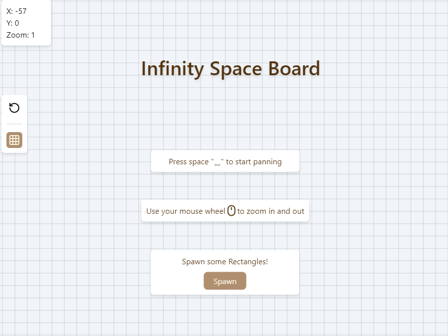

## Repository Information
Infinity Space - Template of a simple Infinite board space, Can be used for all kind of projects.

Build your Infinite space, implement your mechanisem and algorithems.

1. You can use the Board & BoardObject to draw objects on the infinite space (Can Be High Performance Impact).
2. Or you can use <g> elements with <text>/<rect>/<circle> and etc. to draw the objects inside the main <g> element using x & y coordinates (Less Performance Impact) you'll have to change the calculations of the grid and BoardObjects.

## Stack
This template using:
1. NextJS
2. Tailwind
3. Typescript

